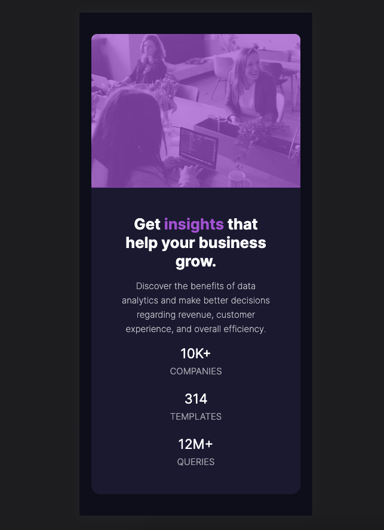
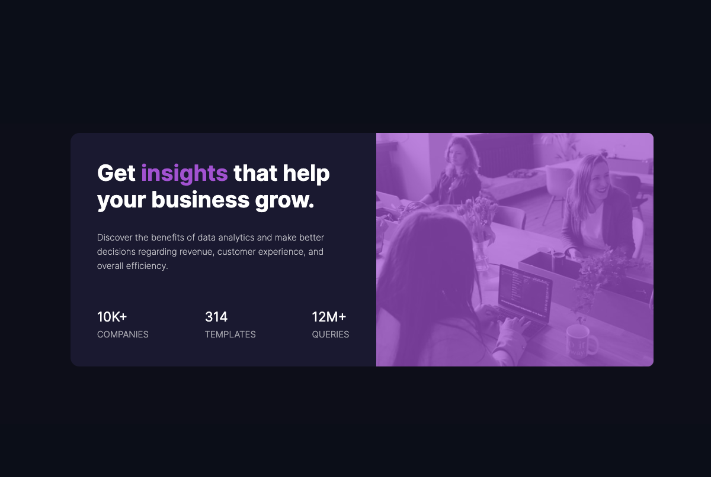

# Frontend Mentor - Stats preview card component solution

This is a solution to the [Stats preview card component challenge on Frontend Mentor](https://www.frontendmentor.io/challenges/stats-preview-card-component-8JqbgoU62). Frontend Mentor challenges help you improve your coding skills by building realistic projects. 

## Table of contents

- [Overview](#overview)
  - [The challenge](#the-challenge)
  - [Screenshot](#screenshot)
  - [Links](#links)
- [My process](#my-process)
  - [Built with](#built-with)
  - [What I learned](#what-i-learned)
  - [Continued development](#continued-development)
  - [Useful resources](#useful-resources)
- [Author](#author)
- [Acknowledgments](#acknowledgments)

## Overview

### The challenge

Users should be able to:

- View the optimal layout depending on their device's screen size

### Screenshot
#### Mobile Device


#### Desktop Device


### Links

- Solution URL: [Solution URL](https://github.com/Kamania/stats-preview-card-component-main)
- Live Site URL: [Live site URL](https://stats-preview-card-component-main-six-delta.vercel.app/)

## My process

### Built with

- Semantic HTML5 markup
- CSS custom properties
- Flexbox
- CSS Grid
- Mobile-first workflow

### What I learned

On this section I was able to learn how to add an overlay color on an image

```html
<div class="hero-img-container">
  <div class="img-hero"></div>
  <div class="overlay"></div>
</div>
```
```css
.hero-img-container {
  position: relative;
  height: 258px;
}

.img-hero, .overlay{
  border-top-right-radius: 10px;
  border-top-left-radius: 10px;
}

.img-hero{
  background-image: url("images/image-header-mobile.jpg");
  height: 100%;
  width: 100%;
  background-size: contain;
  background-repeat: no-repeat;
  position: relative;
  pointer-events: none;
}

.img-hero::before{
  content: '';
  position: absolute;
  top: 0;
  left: 0;
  width: 100%;
  height: 100%;
  background-color: var(--bg-accent);
  opacity: 0;
}

.overlay {
  position: absolute;
  top: 0;
  left: 0;
  width: 100%;
  height: 100%;
  background-color: var(--bg-accent);
  pointer-events: none;
  opacity: .7;
}
```

### Continued development

The project will be implemented using Bootstrap css next

## Author

- Frontend Mentor - [@Kamania](https://www.frontendmentor.io/profile/Kamania)
- Twitter - [@Josephkamania](https://twitter.com/Josephkamania)
